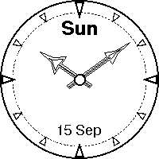

# Smart #

A watch face for the [sqfmi Watchy](https://watchy.sqfmi.com/) watch
and compatible ones.

This is a simple analogue watch face without any frills.

It is a little different from other watchy projects out there in a
couple of respects:

 * The static part of the watch face is designed in
   [Inkscape](https://inkscape.org/) and converted to raster format at
   compile-time.  Attempting to draw lines, decorations and whatnot
   using C++ was ... ahem... simply not suitable. And slow.  Designing
   this in Inkscape is much nicer.

 * The watch hands are also designed using Inkscape, and drawn as
   lines by the code. It makes it very easy to tweak their design.
 
 * The watch hands move precisely as they would on a real mechanical
   analogue watch (but only once per minute). A little fun with
   trigonometry was needed.

# Building It #

To build this, you will need a few things installed:

 * An operating system. I use [Debian GNU/Linux](https://debian.org),
   but any decent Linux distribution should work just as well.  For
   MacOS/Windows: Your mileage will vary, and might not be much at
   all.
 
 * Assuming you want to actually run it: A compatible watch. They are
   sold by e.g. [SQFMI](https://watchy.sqfmi.com/) and probably many
   others. Mine is probably a clone, as I got it from elsewhere (a big
   American retailer named after a rainforest, and who I'm now
   boycotting, so I won't link it here).
 
 * The [Arduino IDE](https://www.arduino.cc/en/software). I used
   version 1.8.19 (as packaged in Debian 12/bookworm), but other
   versions will probably work too.

 * The Aduino IDE board files for the watch. See
   <https://watchy.sqfmi.com/docs/legacy#arduino-setup> for the gory
   details.
 
 * [GNU Make](https://www.gnu.org/software/make/). That's how I build
   things. It is simple, and it works. All the compile-time graphics
   manipulation is done through the `Makefile`.  You can use the
   Arduino IDE to compile/upload the code, but you _need to_ use
   e.g. `make headers` first. Or you can let the `Makefile` do the
   whole thing with just `make upload` - this makes it easy to use an
   external editor.

 * [Inkscape](https://inkscape.org/): Used at build time to get a
   decent SVG -> raster conversion. Also nice if you want to edit the
   designs. I used v1.2.2, but other versions are very likely to work
   out of the box as well.
   
 * [imagemagick](https://imagemagick.org): The compilation process
   uses it to convert raster images to various formats.
   
 * [python](https://www.python.org/): There is a custom python script
   (`svg2multiline.py`) to convert the watch hand SVGs into line
   drawing coordinates. Probably needs python 3.

 * The source code. You are probably looking at in Github, and they
   have directions on how to get a copy.

 * Patience. The build process is slow. Coffee is optional (but
   desirable as always).

If you have everything set up, and the watch connected via USB, then
simply running:

    make upload

should compile the code and upload it to your watch.

# Tweaking It #

See [README-development.md](README-development.md) for that.

# Just So You Know ... #

This is my first foray into the world of Arduino and other embedded
systems: so please bear with me if I'm not following best practices
etc. I don't know what they are yet.

It is also my first attempt at designing a watch face for Watchy;
although I'm pretty pleased with the result, I'm sure there are
graphics artists out there who would rip my design to shreds. That's
OK. I'm still learning.
